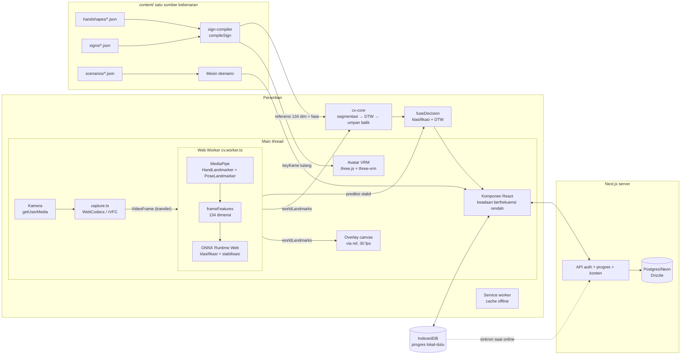

# Arsitektur Lakon

## Prinsip

1. Main thread tidak pernah memproses frame; seluruh CV di Web Worker.
2. Data 30 fps tidak pernah melewati state React; overlay digambar ke canvas via ref.
3. Satu sumber kebenaran: animasi avatar dan referensi verifikasi dikompilasi
   dari spesifikasi parametrik yang sama.
4. Tidak ada frame video yang meninggalkan perangkat.

## Diagram alur data

## Struktur paket

| Paket / direktori        | Isi                                                                                                                        | Aturan                                |
| ------------------------ | -------------------------------------------------------------------------------------------------------------------------- | ------------------------------------- |
| `packages/sign-schema`   | Skema Zod + enum tertutup + validator konten                                                                               | Murni, tanpa DOM                      |
| `packages/sign-compiler` | Spesifikasi → keyframe (IK lengan, SLERP, lintasan, simetri, kontak) → referensi DTW; sumbu engsel bersama M2/M4           | Murni, tanpa DOM (three = matematika) |
| `packages/cv-core`       | frameFeatures 134-dim, DTW terperinci, segmentasi, umpan balik, stabilisasi + fusi klasifikasi                             | Murni, tanpa DOM                      |
| `apps/web/workers`       | cv.worker: MediaPipe + fitur + ONNX                                                                                        | Satu-satunya tempat memproses frame   |
| `apps/web/features`      | avatar (penyelesai rotasi, pemutar), practice (pipeline, overlay, verifikasi), scenario (mesin), progress, collect, editor | Logika tanpa komponen React           |
| `apps/web/components`    | Layar dan blok UI                                                                                                          | Tanpa logika CV                       |
| `content/`               | handshapes, signs, scenarios (JSON, derajat, kebab-case)                                                                   | Gerbang build `review.status`         |
| `training/`              | PyTorch → ONNX; featurisasi Python cermin dari cv-core                                                                     | Laporan akurasi per kontributor       |
| `tools/`                 | validator, seed, fetch-assets, audit aksesibilitas                                                                         | Node, dipakai skrip build             |

## Keputusan penting

- **Penyelesai rotasi (M2)** bekerja pada rig humanoid ternormalisasi three-vrm
  sehingga sumbu engsel jari menjadi konstanta lintas-rig; konstanta yang sama
  dipakai compiler (M4) — satu sumber kebenaran geometri.
- **Referensi verifikasi** dihasilkan dengan membaca balik posisi sendi avatar
  yang telah dipose per frame, lalu melalui `frameFeatures` yang sama dengan
  runtime; tidak ada jalur ganda.
- **Klasifikasi bersifat opsional saat runtime**: tanpa berkas
  `public/models/classifier.json`, sistem menilai dengan DTW saja — melindungi
  demo dari model yang belum siap.
- **Aset MediaPipe di-self-host** (`tools/fetch-assets.mjs` → `public/`) agar
  importScripts bebas dari CDN, ter-cache service worker, dan berfungsi offline.
- **Progres lokal-dulu**: IndexedDB menulis sinkron-instan, antre sinkron ke
  server saat online; akun tidak wajib untuk belajar.
