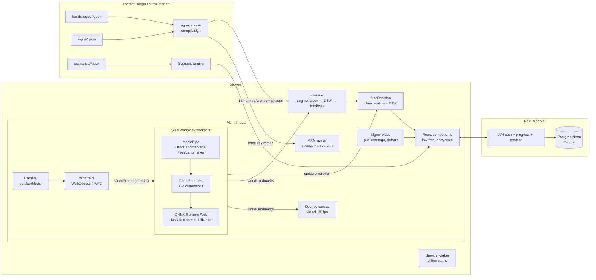

# Lakon architecture

## Principles

1. The main thread never processes frames; all computer vision runs in a Web Worker.
2. 30 fps data never passes through React state; overlays are drawn to a canvas via a ref.
3. One source of truth: the avatar animation and the verification reference are compiled
   from the same parametric specification.
4. No video frame ever leaves the device.

## Data-flow diagram

## Package layout

| Package / directory      | Contents                                                                                                                   | Rule                               |
| ------------------------ | -------------------------------------------------------------------------------------------------------------------------- | ---------------------------------- |
| `packages/sign-schema`   | Zod schemas + closed enums + content validator                                                                             | Pure, no DOM                       |
| `packages/sign-compiler` | Spec → keyframes (arm IK, SLERP, trajectories, symmetry, contact) → DTW reference; hinge axes shared by M2/M4              | Pure, no DOM (three for math only) |
| `packages/cv-core`       | 134-dim frameFeatures, detailed DTW, segmentation, feedback, stabilization + classification fusion                         | Pure, no DOM                       |
| `apps/web/workers`       | cv.worker: MediaPipe + features + ONNX                                                                                     | The only place that handles frames |
| `apps/web/features`      | avatar (rotation solver, player), practice (pipeline, overlay, verification), scenario (engine), progress, collect, editor | Logic without React components     |
| `apps/web/components`    | Screens and UI blocks                                                                                                      | No CV logic                        |
| `content/`               | handshapes, signs, scenarios (JSON, degrees, kebab-case)                                                                   | `review.status` build gate         |
| `training/`              | PyTorch → ONNX; Python featurization mirrors cv-core                                                                       | Per-contributor accuracy report    |
| `tools/`                 | validator, seed, fetch-assets, accessibility audit                                                                         | Node, used by build scripts        |

## Key decisions

- **The rotation solver (M2)** works on three-vrm's normalized humanoid rig, so
  finger hinge axes become cross-rig constants; the compiler (M4) uses the same
  constants — one source of truth for geometry.
- **The verification reference** is produced by reading back the joint
  positions of the avatar posed frame by frame, then passing them through the
  same `frameFeatures` as the runtime; there is no second path.
- **Classification is optional at runtime**: without
  `public/models/classifier.json`, the system scores with DTW alone — which
  protects the demo from a model that is not ready.
- **MediaPipe assets are self-hosted** (`tools/fetch-assets.mjs` → `public/`) so
  importScripts does not depend on a CDN, the service worker caches them, and
  practice works offline.
- **Progress goes straight to the database**: sign progress, checkpoints and
  scenario runs are sent to the API and stored in Postgres. Failed (offline)
  requests are queued in memory and resent once back online; there is no local
  copy.
- **Human demonstration by default**: signs with `media.video` play the signer's
  video (`pnpm peraga` processes `content/BISINDO/`); the 3D avatar stays
  available through a toggle and for the right/left views. Verification still
  uses the reference compiled from the parametric specification.
- **Large screens**: from 1800px the root font size grows in steps
  (`--skala-layar`), so the rem-based layout scales with it; the journey map
  reads the same scale for its SVG geometry.
